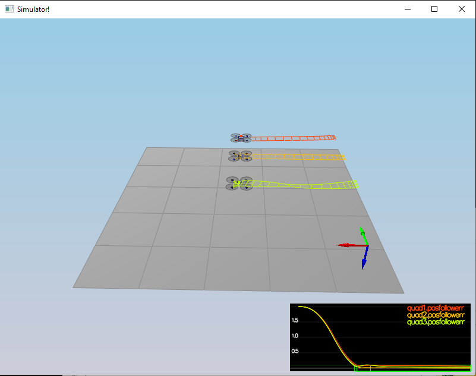

# Implemented Controller
All code references are to QuadControl.cpp.

## Body Rate Control
See QuadControl::BodyRateControl() - Lines 98-121

## Roll Pitch Control
See QuadControl::RollPitchControl() - Lines 123-168

## Altitude Control
See QuadControl::AltitudeControl() - Lines 170-214

## Lateral Position Control
See QuadControl::LateralPositionControl() - Lines 216-264

## Yaw Control
See QuadControl::YawControl() - Lines 266-288

## Motor Commands
See QuadControl::GenerateMotorCommands() - Lines 60-96

# Flight Evaluation
Note that the green highlight in each figure indicates that the scenario passed.

## Scenario 1 - Intro

## Scenario 2 - Attitude Control

## Scenario 3 - Position Control

## Scenario 4 - Nonidealities

## Scenario 5 - Trajectory Following - No Velocity Information

### Top View

### Side View

## Scenario 5 - Trajectory Following - With Velocity Information
Modified MakePeriodicTrajectory.py to output velocity information by taking the derivative of the provided desired position functions.  Had to recall chain rule...it's been awhile.

### Top View

### Side View

As expected, the trajectory following was significantly better when velocity information was provided since this information was able to be fed into the derivative portions of the PD controllers used for altitude and lateral position control.

Without velocity information, the derivative terms for both the altitude and lateral position controllers were simply kd * (0 - actual) since the commanded velocities were all 0 (in the absence of any data).  This seems to have had a larger effect on altitude since the kd gain for the altitude controller was much larger than the kd gain for the lateral position controllers (50 [z] vs 11 [both x and y]).  Without velocity information, it seems like it would have made more sense to 0 out the kd gains for altitude and lateral position control, but in any case, with velocity information the derivative portion of the altitude and lateral position controllers were able to work as expected, resulting in much better trajectory following.

Adding feedforward acceleration information to the trajectories could improve trajectory following even more; since the trajectories were provided in analytical form, feedforward acceleration is just another derivative after velocity.

## External Forces
For Scenario 4 - Nonidealities, also tested with a variety of external forces applied.  In these cases, the controls were able to respond to the disturbances caused by the external forces and achieve fairly good tracking.  Although the tracking in these cases did not always achieve the performance thresholds for the non-disturbance cases for this project; perhaps through more control parameter tuning...

### Scenario 4 - Nonidealities - Up Force Applied For Entire Trajectory

### Scenario 4 - Nonidealities - Down And Right Forces Applied For Entire Trajectory

